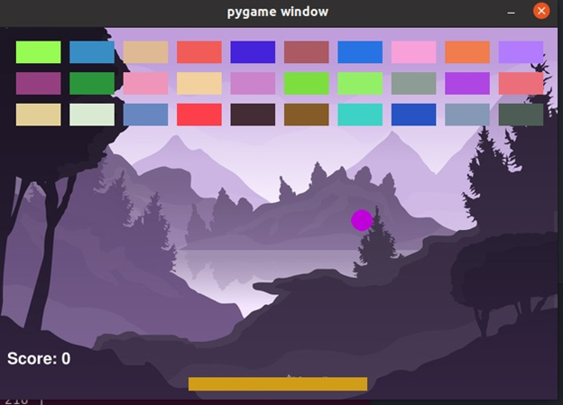
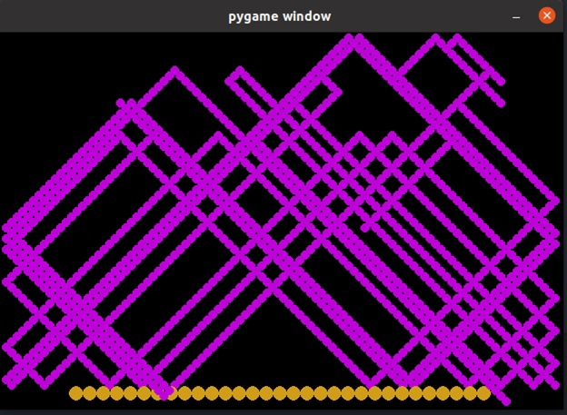

# Траектория передвижения тележки и шарика

***

## Описание

В проекте реализована визуализация траектории движения шарика и тележки, а также игра _arconoid_, которая моделирует движение шарика и тележки.

Используются:
* Приложения на Python
* Mosquitto
* InfluxDB

---

## Запуск

В терминале необходимо прописать следующие команды для запуска приложений:


_Терминал 1_
```
>>> docker compose build


>>> docker compose up
```

Далее необходимо создать виртуальное окружение с любым именем (в примере это имя _venv_) в текущей папке и активировать его (пример для Linux):

_Терминал 2_
```
>>> python3 -m venv venv
```

_Терминал 2 и 3_
```
>>> source venv/bin/activate

```

Далее устанавливаем все пакеты указанные в _reqs.txt_

_Терминал 2_
```
>>> pip install -r reqs.txt
```

После запускаем файлы trajectory.py и publisher.py

_Терминал 2_
```
>>> python3 trajectory.py
```

_Терминал 3_
```
>>> python3 publisher.py

```

---

## Результат





